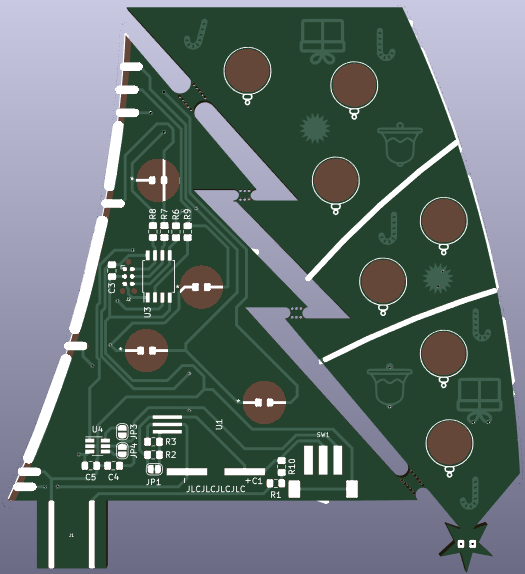
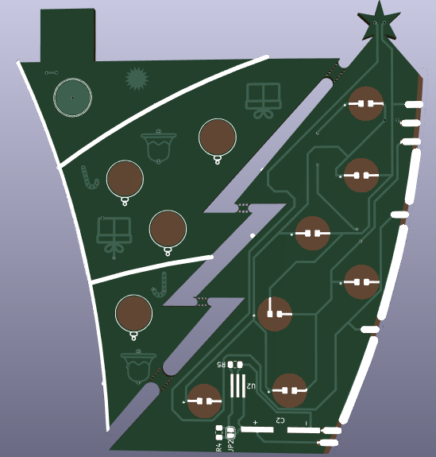
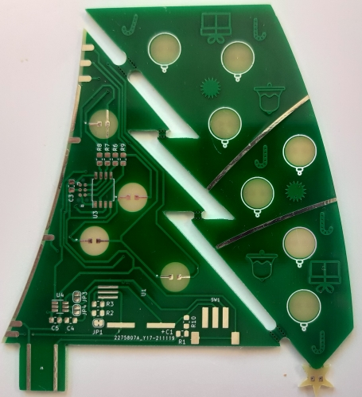

# PCB Christmas Tree
This project is a simple PCB based Christmas ornament with blinky LEDs and rechargeable supercaps.

---

<div style="float:left;"> 
    
</div> 

---   

### Hardware

---

Project was done in Kicad (yay for open-source !). Project files are here: ```Hardware\Kicad\```, including the custom footprint library ```Hardware\Kicad\christmas_tree.pretty```.


#### Schematic

---

Schematic : ```Hardware\schematic.pdf```

Bill of Materials : ```Hardware\BOM.csv```

Components were chosen based on my current stock. 
* **Power storage**: Instead of traditional batteries, 2 Maxwell 10F 2.7V supercapacitors were used as rechargeable storage, just because I have a bunch of them and don't like non-rechargeable gadgets. Granted, I estimated the tree can only run about 1 hour max per charge (approx. 6mA average current draw), which is not great considering a single CR2032 could probably last several weeks. But, supercaps are fun and you can recharge them with any USB port in <1min.
* **Charging**: An integrated USB connector allows direct charging of the supercaps, through a current limiting resistor. Do not make it less than ~15Ω to not exceed USB spec current capabilities. I added an optional charge balancing circuitry with TL431 shunt Vref, but didn't used it in the end as my caps were quite similar in capacity.
* **Brain of the operations**: I used the ever popular Attiny 25/45/85 series, a small 8-bit AVR micro which offers more than enough capabilities & programming space than I need. Programming port is a TagConnect footprint modified to remove the through holes.
* **LEDs**: Given the limited amount of GPIOs on the µC, I turned to [Charlieplexing](https://en.wikipedia.org/wiki/Charlieplexing), which allows with some clever tricks to drive 12 LEDs with only 4 pins. One thing though, if you want to use different color LEDs you won't be able to adjust their individual brightness easily, so blue LEDs will be dimmer than red by example.
* **Touch button**: For extra fanciness I added a TTP223 touch sensor chip, which allows to cycle between different display modes. The default config works fine even if not populated.


#### Layout

---

To keep this project cheap, the goal was to fit the whole layout on a 10x10cm 2 layer board, which JLCPCB famously offers at 2$ for 5pcs. Decision was made to split the tree in 2 halves that would then be soldered back together, to get a bit extra height. 

For the 1st time I experimented with using the different layers (bare FR4 material, bare copper, copper+soldermask, bare soldermask and silkscreen) to make a somewhat artistic result. For more info on the colors you can get when playing with PCBs I would recommend visiting [this page](https://github.com/Hanqaqa/PCB_Color_Palette).

- Exposed pads spanning the 2 halves of the tree allow to join them and propagate the tracks for the LEDs
- Leds are reverse mounted so they shine through the board: solder mask keepout areas are placed on both sides to let the light through.
- Base of the tree doubles as a USB A port to easily recharge the batteries
- Supercapacitors provide mechanical support to stand the tree upright

<div style="float:left;"> 
    
    
</div> 


#### Ordering

---

Zipped gerbers are available (```Hardware\Kicad\gerbers.zip```)to be directly dropped on manufacturers websites like JLCPCB. I used their excellent prototype service for my boards, both cheap and quick.

Feel free to use these files as is or modify and improve the project. Don't forget to share our version as well!

Final dimensions are 88.7mm*98mm.

Ordering settings: 2 layers, 1.6mm board thickness, white silkscreen, HASL(with lead) surface finish, 1oz copper weight, Specify a location for Remove Order Number,

In the Remarks field: "Please note: Some parts use Solder Mask Defined Pads. Do not compensate/modify the solder mask for them. No edge plating required. Center cutout to be routed and discarded."

#### Assembly

---

<div style="float:left;"> 
    
    
</div> 
The PCB comes with the 2 halves attached with mousebites. Once separated the remaining burs can be filed off.
<div style="float:left;"> 
    
    
    
</div> 

Minimum components to be assembled are: C1&C2 supercaps, SW1 power switch, U3 microcontroller, R1 & R10 charging resistors, the 4 220Ω resistors and the LEDs.

To avoid making a custom TagConnect to ICSP adapter, the µC can be programmed in a socket before being soldered on the board.


#### Programming

---

Precompiled version of the firmware: ```Software\main.hex```

To upload using avrdude, run the following commands : `avrdude -u -c usbtiny -p t85 -B 5 -F -U flash:w:main.hex:a -U lfuse:w:0xE2:m -U hfuse:w:0xDF:m -U efuse:w:0xFF:m`

---
---

### Software

---

Software uses Timer1 to cycle between each LED and light it using a 4 bit intensity scale. Several blinking modes can be cycled through with the touch button: fade (default), pixies and debug (one LED at a time)

```Program: 922 bytes (11.3% Full) & Data: 36 bytes (TODO% Full)```


|               |      | Average consumption (mA) |              | 5                | F total capacitance             |
|---------------|------|--------------------------|--------------|------------------|---------------------------------|
|               |      | All on mode              | Economy mode | E(J)             |                                 |
| V full charge | 5    | 4.2                      | 0.9          | 62.5             | Energy when at max voltage      |
| V min working | 2.5  | 1.1                      | 0.34         | 15.625           | Energy left when at min voltage |
| V average     | 3.75 | 2.65                     | 0.62         | 46.875           | Usable energy                   |
|               |      |                          |              | 3.472            | mAh usable capacity             |
|               |      | 01h18min                 | 05h36min     | Expected runtime |                                 |

